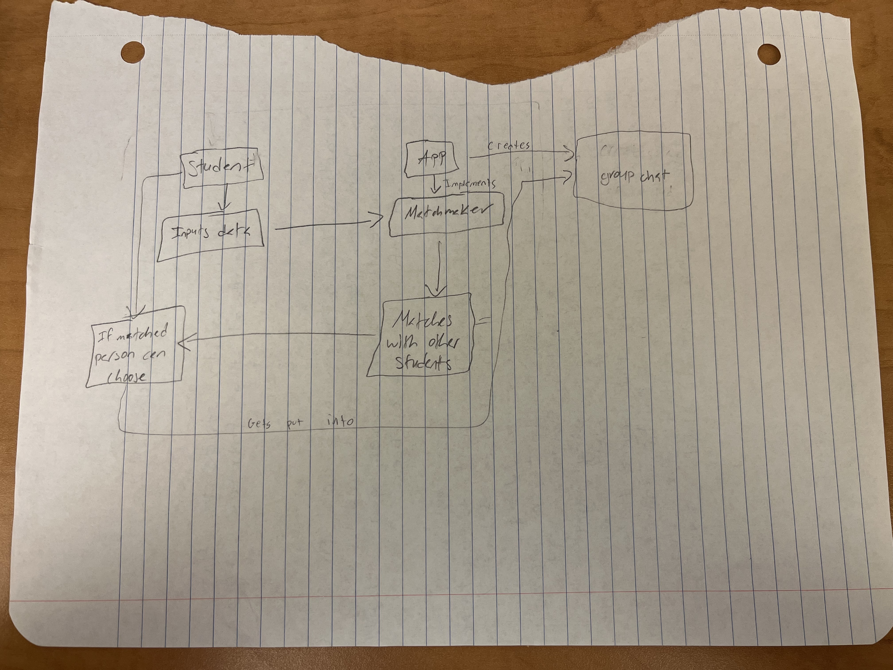

# StudyBuddy

## Project Overview
StudyBuddy is a web-based platform that connects students with compatible study partners. The app allows users to create profiles, securely log in, swipe through other students’ profiles (Tinder-style), and chat with matches. The goal is to make finding study partners simple, interactive, and personalized.

## Agile Methodology
We plan to build our system using sprints discussed in class where each sprint produces a usable feature. For this first sprint we plan to create the profile/login system. Our next sprint will focus on the swipe/matching feature. We hold meetings every Saturaday to discuss where we are at in the sprint and address issues that arise. Each sprint will begin with a user story and storyboard which is integrated in the github under issues.

## System Sketch

